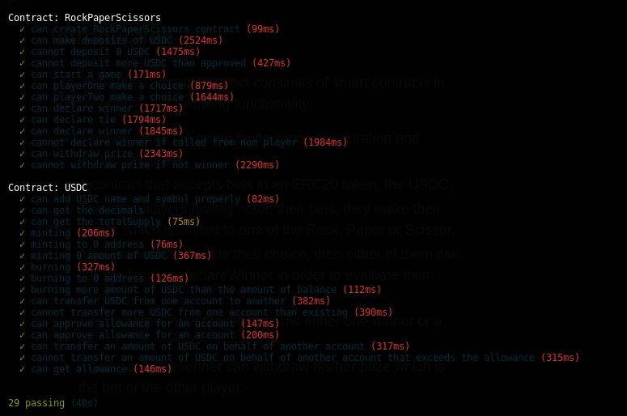

# RockPaperScissors

##### Table of Contents  
- [Introduction](#introduction)
- [System Design](#system-design)
- [Testing](#testing)
- [Built With](#built-with)

## Introduction
The RockPaperScissors project consinsts of smart contracts in Solidity offering the following functionality:

- A player starts the game by declaring the duration and his/her opponent.
- A contract that accepts bets in an ERC20 token, the USDC.
- Then the pllayers having made their bets, they make their choice which is limited to one of the Rock, Paper or Scissor.
- After both players made their choice, then either of them can call the function declareWinner in order to evaluate their choices.
- The declareWinner function returns either one winner or a tie.
- Finally, only the winner can withdraw his/her prize which is the bet of the other player.

The contracts are written using the **Solidity compiler 0.8.7 version**. In this project the Truffle Suite is utilized in order to run a local blockchain and deploy the smart contracts on top of it. You have to change the pragma version which is used in **Ownable.sol** and **ERC20.sol** to: `pragma solidity 0.8.7;` 

## System Design
The functionality offered by the RockPaperScissors project is implemented by 1 smart contract and 1 helper smart contract:

- **RockPaperScissors.sol**: This contract holds all main functionality offered for the purpose of this game.
- **USDC.sol**: This contract is used in the context of this project in order to create an ERC-20 token which mocks USDC tokens.

## Testing

To test the FarmSwap follow the instructions below.

Download the repo, navigate into the root directory of the project and follow the steps below in order to test it:

1. Install dependencies:

``npm install``

2. Open the truffle interactive console that also spawns a development blockchain:

`truffle develop`

3. Then inside the truffle console invoke the test command:

`test`

The last command will compile the contracts and then perform the tests.

### Testing the Smart Contracts
The result of the tests should look like the following:

## Built With

* [Solidity](https://solidity.readthedocs.io/en/v0.5.3/) - Solidity is an object-oriented, high-level language for implementing smart contracts.
* [Truffle Framework](http://truffleframework.com/) - Truffle is the most popular development framework for Ethereum with a mission to make your life a whole lot easier.
* [Ganache Local Blockchain](http://truffleframework.com/ganache/)
* [Remix Solidity IDE](https://remix.ethereum.org/)
